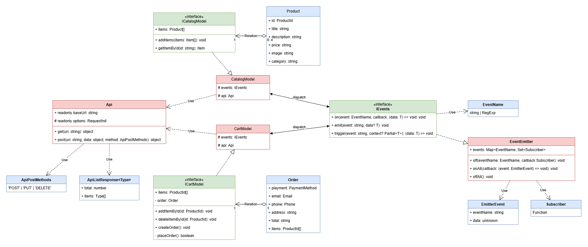
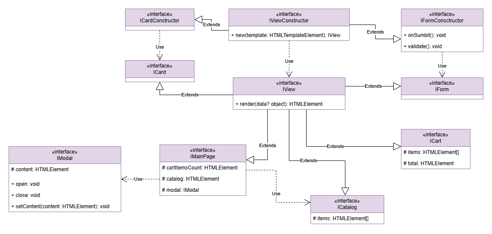

# Проектная работа "Веб-ларек"

Стек: HTML, SCSS, TS, Webpack

Структура проекта:
- src/ — исходные файлы проекта
- src/components/ — папка с JS компонентами
- src/components/base/ — папка с базовым кодом

Важные файлы:
- src/pages/index.html — HTML-файл главной страницы
- src/types/index.ts — файл с типами
- src/index.ts — точка входа приложения
- src/scss/styles.scss — корневой файл стилей
- src/utils/constants.ts — файл с константами
- src/utils/utils.ts — файл с утилитами

## Установка и запуск
Для установки и запуска проекта необходимо выполнить команды

```
npm install
npm run start
```

или

```
yarn
yarn start
```
## Сборка

```
npm run build
```

или

```
yarn build
```

# Архитектура

В приложении используется архитектурный подход **MVP**. Взаимодействия между компонентами происходит посредством применения шаблона `EventEmitter`.

## Базовый код

- `IEvents` - интерфейс для работы с событиями.
- `EventEmitter` - классический брокер событий, реализующий паттерн EventEmitter.
- `Api` - класс для работы с API сервера.

## Компоненты модели данных

`Product` - обладающий уникальным идентификатором `ProductId` набор данных определяющий товар. В общем виде товар определяется несколькими полями: идентификатор, наименование, описание, категория, изображение, цена.

`Order` - заказ, который оформляет пользователь вводя необходимые данные через форму: тип платежа, включает в себя адрес доставки, email и номер телефона. Заказ так же включает в себя список идентификаторов товаров и общую стоимость заказа. Данные в виде json будут отправляться на сервер.

---
`ICatalogModel` - интерфейс для модели каталога товаров. Модель содержит коллекцию товаров `Product`. С каталогом товаром можно осуществить следующие действия:
* заполнить каталог списком товаров.
* получить товар по идентификатору.

`ICartModel` - интерфейс для модели корзины. Корзина содержит коллекцию товаров `Product`. С корзиной можно осуществить следующие действия:
* отобразить список товаров.
* добавить товар в корзину.
* удалить товар из корзины по идентификатору.
* оформить заказ товаров в корзине.

## Компоненты представления

* `IMainPage` - интерфейс компонента главной страницы приложения. Главная страница включает в себя отображение галереи каталога товаров, после загрузки данных с сервера и счетчик добавленных в корзину товаров.
* `ICatalog` - галерея каталога товаров, содержит коллекцию HTML элементов карточек товаров.
* `ICart` - содержимое корзины, содержит коллекцию HTML элементов карточек товаров, а так же полную стоимость всех товаров в корзине.
* `IView` - универсальный интерфейс представления, обладающий единственным методом отображения содержимого.
* `IViewConstructor` - универсальный интерфейс конструктора представления. Предназначен для возможности создания представления `IView` через конструктор new с передачей в него шаблона элемента. Все представления которые необходимо создавать из заготовленного шаблона будут наследовать его.
* `ICard` - интерфейс для представления карточки товара, наследуется от универсального интерфейса представления.

В приложении существуют различные шаблоны отображения карточек. Для отображения каждой существует отдельный класс реализующий интерфейс `ICardView` с необходимым набором HTML элементов для каждого случая:
```typescript
class CardInCatalog implements ICard {
	protected _id: ProductId;
	protected title: HTMLElement;
	protected description: HTMLElement;
	protected category: HTMLElement;
	protected price: HTMLElement;
}

class CardPreview extends CardCatalog {
	protected image: HTMLElement;
}

class CardInCart implements ICard {
	protected _title: HTMLElement;
}
```

* `IForm` - универсальный интерфейс для форм, расширяет интерфейс `IView` методами отправки и валидации.
* `OrderForm` - форма оформления заказа. Класс, которые реализует интерфейс представления `IForm`. Форма создается из html-шаблона.
* `ContactsForm` - форма заполнения контактных данных пользователя. Класс, который реализует интерфейс `IForm`.
* `OrderSuccess` - представление успешного оформления заказа.

В приложении присутствуют две формы для оформления заказа:
```typescript
class OrderForm implements IForm {
	protected paymentMethodButtons: HTMLButtonElement[];
	protected addressInput: HTMLInputElement;
	protected submitButton: HTMLButtonElement;
}

class ContactsForm implements IForm {
	protected emailInput: HTMLInputElement;
	protected phoneInput: HTMLInputElement;
	protected submitButton: HTMLButtonElement;
}
```

* `IModal` - интерфейс модального окна, в которое можно передать любой `HTMLElement` в виде контента. Обладает методами открытия и закрытия, а так же методом для изменения основного контента окна.

## Presenters

* `ApplicationPresenter` - основное presenter  приложения
* `CartPresenter` - presenter для работы с корзиной.
* `CatalogPresenter` - presenter для работы с каталогом товаров.

```typescript
class ApplicationPresenter {
	protected mainPageContainer: IMainPage;
	protected modalContainer: IModal;
	protected orderForm: IForm;
	protected contactsForm: IFrom;
	protected orderSuccessContainer: IView;

	protected cartPresenter: CartPresenter;
	protected catalogPresenter: CatalogPresenter;
	
	renderView(): void {}
	openModal(content: IView): void {}
}

class CartPresenter {
	protected cartModel: ICartModel;
	protected cartContainer: ICart;
	protected cardInCart: IView;

	renderView(): void {}
}

class CatalogPresenter {
	protected catalogModel: ICatalogModel;
	protected catalogContainer: ICatalog;
	protected cardInCatalog: IView;
	protected cardPreview: IView;

	renderView(): void {}
}
```
## Пользовательские сценарии

Описание пользовательских сценариев и событий для работы `EventEmitter`.
Наименование события представляет собой строку в формате "snake case", где через двоеточие указан контекст (инициатор события) событие и его название, определяющее, что произошло:
`context:something_happened`

### Загрузка главного окна приложения

При входе пользователя на главную страницу приложения в `ApplicationPresenter` происходит инициализация модели каталога `CatalogModel` через `CatalogPresenter` посредством запроса на backend API (`GET /product/`).

После успешного выполнения запроса, полученный список товара добавляется в коллекцию модели каталога и генерируется событие `catalog:items_loaded` с данными в виде списка items (товаров).

Это событие обрабатывает `CatalogPresenter`, который выполняет render галереи в представлении каталога товаров `Catalog` на html-странице. Карточка каждого товара создается по шаблону `CardInCatalog` и добавляются массивом html-элементов в `Catalog`.

Дополнительно происходит инициализация модели корзины. Из локального хранилища в браузере ключу `cart` подгружается список товаров и добавляется в коллекцию модели корзины, далее генерируется событие об изменении содержимого корзины `cart:content_changed` с этим списком товаров и обрабатывается в соответствующем [сценарии](#изменение-состояния-корзины).

### Нажатие на карточку с товаров

При нажатии на карточку товара в представлении каталога `Catalog` генерируется событие `catalog:card_selected` с идентификатором выбранного товара. Событие обрабатывается в `ApplicationPresenter`, где через `CatalogPresenter` происходит создание по шаблону `CardPreview` html-элемента, из объекта товара `Product`, полученного по запросу на backend (`GET /product/:productId`). Созданный html-элемент передается в виде контента экземпляру модального окна, после чего происходит его открытие.

### Добавление товара в корзину

При нажатии на кнопку "В корзину" в каталоге товаров `Catalog` генерируется событие `cart:item_added`, куда передается идентификатор карточки товара добавляемого в корзину. На событие подписан `ApplicationPresenter`, который, через `CatalogPresenter` ищет товара по идентификатору в модели каталога `CatalogModel` и добавляет товар в модель корзины  `CartModel`. Так же обновляется локальное хранилище в браузере по ключу `cart`. 

После обновления модели корзины генерируется событие `cart:content_changed` и обрабатывается в соответствующем [сценарии](#изменение-состояния-корзины).

### Удаление товара из корзины

При нажатии на кнопку удаления товара из корзины `Cart` генерируется событие `cart:item_deleted`, куда передается идентификатор товара удаляемого из корзины.

На событие подписан `CartPresenter`, в которой обновляется коллекция модели корзины `CartModel` и локальное хранилище корзины по ключу `cart`. После обновления модели корзины генерируется событие `cart:content_changed` и обрабатывается в соответствующем [сценарии](#изменение-состояния-корзины).

### Изменение состояния корзины

При любом изменении корзины, добавление, удаление товара или успешное оформление заказа генерируется событие `cart:content_changed` с телом в виде актуального списка товаров.

Если в данное время модульное окно с содержимым корзины открыто, то происходит обновление представления корзины `Cart`. Обновление общего количества товаров на главной странице происходит всегда в `MainPage` через `ApplicationPresenter`, благодаря тому что он подписан на данное событие.

### Открытие корзины

При нажатии на иконку корзины, генерируется событие `cart:opened` с пустым телом, на которое подписан `ApplicationPresenter`. Он в свою очередь через `CartPresenter` получает список html-элементов, созданных по шаблону `CardInCart` и коллекции товаров в модели корзины. Созданный список html-элементов передается в представление корзины `Cart`, которое в виде контента передается экземпляру модального окна, после чего происходит его открытие.

### Оформление заказа

При нажатии на кнопку оформления заказа генерируется событие `order:created` с пустым телом. Событие обрабатывается в `CartPresenter`, где из данных модели корзины создается объект `Order` с исходными данными в виде списка идентификаторов товаров и общего количество оформляемых товаров. Объект оформляемого заказа хранится в модели корзины. После успешного создания заказа, текущее модальное окно с контентом корзины закрывается и генерируется событие `order:formed` с данными в виде объекта `Order`, на которое подписан `ApplicationPresenter`, для того чтобы открыть новое модальное окно с формой оформления заказа `OrderForm`.

При успешной отправки формы оформления заказа, объект `Order` дополняется данными: способ оплаты и адрес доставки. Проверяется корректное заполнение формы и после успешного оформления заказа текущее модальное окно закрывается и генерируется новое событие `order:payment_selected`, в которое передается обновленный объект `Order`. На событие подписан `ApplicationPresenter`, для того чтобы открыть новое модальное окно с формой заполнения контактных данных `ContactsForm`.

При успешной отправки формы с контактными данными, объект `Order` дополняется данными: телефон и адрес доставки.
Проверяется корректное заполнение формы и через API отправляется запрос на backend (`POST /order`).

После успешной отправки заказа на сервер текущее модальное окно закрывается и генерируется новое событие `order:placed`. На событие подписан `ApplicationPresenter`, который открывает модальное окно с информацией об успешном оформлении заказа `OrderSuccess` со значением списанных с баланса средств.

### Ошибка в работе приложения

При возникновении ошибок в работе приложения при взаимодействии с сервером, детали ошибки отображается в модальном окне.

### Список событий сформированный по пользовательским сценариям

* **'catalog:items_loaded'** - список товаров загружен.
* **'catalog:card_selected'** - выбрана карточка товара.
* **'cart:item_added'** - товар добавлен в корзину.
* **'cart:item_deleted'** - товар удален из корзины.
* **'cart:content_changed'** - изменено содержимое корзины.
* **'order:created'** - заказ создан.
* **'order:formed'** - заказ сформирован.
* **'order:payment_selected'** - выбран способ оплаты заказа.
* **'order:placed'** - заказ оформлен.

## UML-диаграмма модели и представлений



