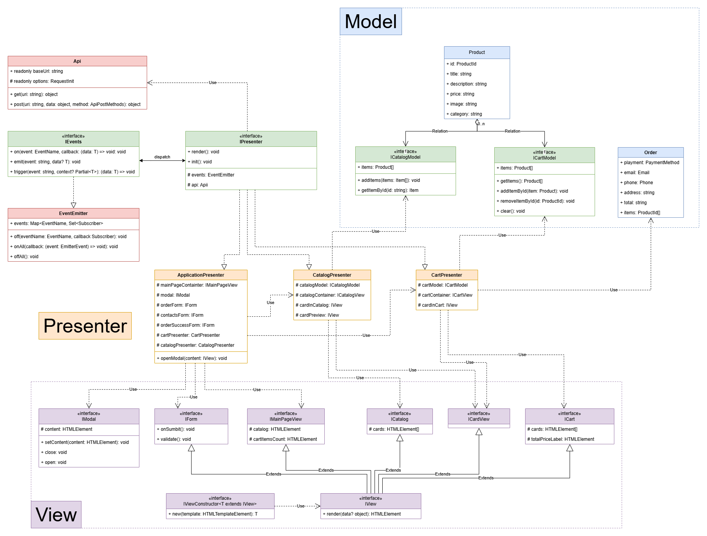

# Проектная работа "Веб-ларек"

Стек: HTML, SCSS, TS, Webpack

Структура проекта:
- src/ — исходные файлы проекта
- src/components/ — папка с JS компонентами
- src/components/base/ — папка с базовым кодом

Важные файлы:
- src/pages/index.html — HTML-файл главной страницы
- src/types/index.ts — файл с типами
- src/index.ts — точка входа приложения
- src/scss/styles.scss — корневой файл стилей
- src/utils/constants.ts — файл с константами
- src/utils/utils.ts — файл с утилитами

## Установка и запуск
Для установки и запуска проекта необходимо выполнить команды

```
npm install
npm run start
```

или

```
yarn
yarn start
```
## Сборка

```
npm run build
```

или

```
yarn build
```

# Архитектура

В приложении используется архитектурный подход **MVP**. 

## Об архитектуре

Взаимодействия внутри приложения происходят через события, посредством применения шаблона `EventEmitter`. События инициализируются моделями и представлениями, слушателями событий являются классы Presenters. Это посредники между моделью и представлением, в которых выполняется основная бизнес-логика приложения (изменение модели и отрисовка элементов html-страницы).

## UML-диаграмма архитектуры



## Базовый код

`IEvents` - интерфейс для работы с событиями, обладающий тремя основными методами: `on` - для подписки на событие, `emit` - для инициации события и `trigger` - для создания callback триггера, события с заданными
аргументами. Это позволяет передавать его в качестве обработчика события в другие классы. Эти
классы будут генерировать события, не будучи при этом напрямую зависимыми от класса `EventEmitter`.

`EventEmitter` - классический брокер событий, реализующий паттерн **EventEmitter** (Наблюдатель). Позволяет подписываться на события и уведомлять подписчиков. Дополнительно реализованы методы `off` - для отписки от события, `onAll` - для подписки на все события и `offAll` - для сброса всех подписок.

`Api` - класс для работы с backend API. 
* `constructor(baseUrl: string, options: RequestInit = {})`- в конструкторе класса передается базовый url ресурса и дополнительный опции для всех запросов.
* `protected handleResponse<T>(response: Response): Promise<T>` - метод обработки запросов, возвращает json в случае успеха или ошибку.
* `get<T>(uri: string)` - выполнение запроса с методом GET для получения данных по запросу.
* `post<T>(uri: string, data: object, method: ApiPostMethods = 'POST')` - выполнение запроса с методом POST для передачи данных на backend.

`Component<T>` - абстрактный класс представления с набором базового функционала для работы с представлениями, где T это тип/интерфейс объекта, который мы хотим отобразить на странице.
* `protected constructor(protected readonly container: HTMLElement)` - конструктор принимающий html-элемента как основном контейнер (обертку) представления.
* `render(data?: Partial<T>): HTMLElement` - метод отрисовки представления, позволяющий при наличии у компонента правильных setter`ов автоматически согласовать поля между объектом с частичными данными Partial<T> и html-элементами.

`Presenter` - абстрактный класс presenter с набором базовых абстрактных методов и конструктора.
* `constructor(protected readonly api: ApplicationApi, protected readonly events: IEvents)` - конструктор принимающий экземпляр класса ApplicationApi и EventEmitter.
* `init(): void` - метод инициализации компонентов presenter'а.

## Компоненты модели данных

`ApplicationApi` - класс для работы с backend API, использующий `Api` и обладающий готовыми методами для работы с товарами и заказами:
* `api: Api` - поле базового класса.
* `constructor(api: Api)`- в конструкторе класса передается экземпляр класса `Api`.
* `getProducts(): Promise<ApiListResponse<Product>>` - делает запрос на backend и возвращает список товаров.
* `getProduct(id: ProductId): Promise<Product>` - делает запрос на backend и возвращает товара по идентификатору.
* `placeOrder(order: Order): Promise<object>` - делает запрос на backend для оформления заказа.

`Product` - обладающий уникальным идентификатором `ProductId` набор данных определяющий товар. В общем виде товар определяется несколькими полями:
* `ProductId` - идентификатор, простой тип на основе `string`.
* `title: string` - наименование.
* `description: string` - описание.
* `category: string` - категория.
* `image: string` - изображение.
* `price: number` - цена.

`Order` - заказ, который оформляет пользователь по списку товаров в корзине:
* `items: ProductId[]` - массив идентификаторов товаров из корзины.
* `total: number` - общая стоимость товаров в заказе.
Через форму дополняется необходимыми данными:
* `payment: PaymentMethod` - тип платежа, простой тип на основе строк перечисления `'online'`, '`'on_delivery'`
* `address: string` - адрес доставки.
* `email: Email` - email пользователя
* `phone: Phone` - номер телефона пользователя

---
`ICatalogModel` - интерфейс для модели каталога товаров, для хранения и работы с коллекцией товаров.
* `items: Product[]` - коллекция товаров и setter для данного поля.
* `set items(items: Product[]): void` - заполнить каталог списком товаров. 
* `getItemById(id: ProductId): Product` - получить товар по идентификатору.

`ICartModel` - интерфейс для модели корзины, для хранения и работы с коллекцией товаров `items: Product[]`. С корзиной можно осуществить следующие действия:
* `getItems(): Prodcut[]` - получить список товаров.
* `addItem(item: Product): void` - добавить товар в корзину.
* `removeItemById(id: ProductId): void` - удалить товар из корзины по идентификатору.
* `clear(): void` - очистить корзину.

## Компоненты представления

### Основные элементы страницы

`IMainPageView` - интерфейс компонента представления главной страницы приложения, расширяет `IView`. Главная страница включает в себя:
* `catalog: HTMLElement` - элемент каталога/галереи товаров. Селектор класса`'.gallery'`.
* `cartItemsCount: HTMLElement` - элемент счетчика добавленных в корзину товаров. Селектор класса`'.header__basket-counter'`.

`ICatalogView` - галерея каталога товаров, расширяет базовый компонент представления `Component<{items: Product[]}>` и содержит:
* `cards: HTMLElement[]` - коллекцию HTML элементов карточек товаров.

`ICartView` - содержимое корзины, расширяет `IViewConstructor`, создается по шаблону c id `'#basket'` и содержит:
* `cards: HTMLElement[]` - коллекцию HTML элементов карточек товаров.
* `itemListElement: HTMLUListElement` - обертка для списка карточек товаров.
* `totalPriceElement: HTMLElement` - элемент по селектору `'.basket__price'`, содержащий информацию о полной стоимости товаров в корзине.
* `cartButton: HTMLButtonElement` - кнопка удаления товара из корзины.

---

### Карточки товаров

В приложении существуют различные шаблоны отображения карточек. Для отображения каждой существует отдельный класс:

`Card` - класс карточки товара в галереи каталога, расширяет базовый компонент представления `Component<Product>`, создается по шаблону `'#card-catalog'`:
* `productId: ProductId` - идентификатор товара и setter для данного элемента. Используется для событий.
* `title: HTMLElement` - наименование товара и setter для данного элемента.
* `image: HTMLElement` - изображение товара и setter для данного элемента.
* `category: HTMLElement` - категория товара и setter для данного элемента.
* `price: HTMLElement` - цена товара и setter для данного элемента.

`CardPreview` - класс карточки товара для отображения полного описания товара, расширяет базовый компонент представления `Component<Product>`, создается по шаблону `'#card-preview'`:
* `productId: ProductId` - идентификатор товара и setter для данного элемента. Используется для событий.
* `inCart: boolean` - флаг отражающие состояние карточки товара, в зависимости от нахождения товара в корзине.
* `title: HTMLElement` - наименование товара и setter для данного элемента.
* `image: HTMLElement` - изображение товара и setter для данного элемента.
* `category: HTMLElement` - категория товара и setter для данного элемента.
* `price: HTMLElement` - цена товара и setter для данного элемента.
* `description: HTMLElement` - описание товара и setter для данного элемента.
* `сardButton: HTMLButtonElement` - кнопка покупки товара (добавление товара в корзину).
* `toggleCartState(inCard: boolean)` - изменение состояния превью в зависимости от того добавлен ли текущей отображаемый товар в корзину или нет. 

`CardInCart` - класс карточки товара для отображения полного описания товара, реализует `ICardView`, создается по шаблону `'#card-basket'`:
* `productId: ProductId` - идентификатор товара и setter для данного элемента. Используется для событий.
* `indexElement: HTMLSpanElement` - индекс товара в корзине и setter для данного элемента.
* `titleElement: HTMLHeadingElement` - наименование товара и setter для данного элемента.
* `priceElement: HTMLSpanElement` - цена товара и setter для данного элемента.
* `deleteCardButton: HTMLButtonElement` - кнопка удаления товара из корзины.

---
### Формы

`IForm` - универсальный интерфейс для форм, расширяет интерфейс `IView` методами отправки и валидации:
* `submitButton: HTMLButtonElement` - кнопка отправки формы.
* `onSubmit: () => void` - отправка формы.
* `validate: () => void` - валидация формы.
* `getFormData: () => object` - получить данные формы.

`OrderForm` - форма оформления заказа. Класс, которые реализует интерфейс представления `IForm`. Форма создается из html-шаблона по id `'#order'`. Компоненты формы:
* `paymentButton: HTMLButtonElement[]` - кнопки выбора формы оплаты `'.card'`, `'.cash'`.
* `addressInput: HTMLInputElement` - поле ввода адреса `'.address'`.

`ContactsForm` - форма заполнения контактных данных пользователя. Класс, который реализует интерфейс `IForm`.  Форма создается из html-шаблона по id `'#contacts'`. Компоненты формы:
* `emailInput: HTMLInputElement` - поле ввода e-mail `'.email'`.
* `phoneInput: HTMLInputElement` - поле ввода телефона `'.phone'`.

`OrderSuccess` - представление успешного оформления заказа, расширяет интерфейс `IForm` с единственным полем:
* `description: HTMLElement` - блок текста `'.order-success__description'`.

---

### Модальное окно

`IModal` - интерфейс модального окна, которое создается блоком `'#modal-container'`. Расширяет базовый компонент представления `Component<Modal>`.
* `content: HTMLElement` - контент модального окна и setter для данного элемента.

Обладает методами открытия `open: () => void` и закрытия `close: () => void`.

## Presenters

Создание всех presenter происходит в файле `src/index.ts` после получения всех необходимых шаблонов и элементов страницы и создания экземпляров моделей.

`ApplicationPresenter` - класс, основной presenter приложения, расширяет базовый абстрактный класс `Presenter`. Реализует основную бизнес-логику приложения, подписывается на события, которые генерируют компоненты представления и модели. Обрабатывает события, изменяя модель и вызывает перерисовку представлений. Управляет модальными окнами. Представляет собой фасад для других presenter'ов.
Конструктор класса:
* `constructor(api: Api, events: IEvents, catalogPresenter: CatalogPresenter, cartPresenter: CartPresenter)` - конструктор, расширяющий базовый за счет `CatalogPresenter` и `CartPresenter`.
Поля класса:
* `mainPageContainer: IMainPageView` - представление главной страницы.
* `modal: IModal` - экземпляр модального окна.
* `orderForm: IForm` - форма оформления заказа.
* `contactsForm: IFrom` - форма заполнения контактных данных.
* `orderSuccessForm: IFrom` - форма сообщения об успешно оформленном заказе.
* `cartPresenter: CartPresenter` - presenter корзина.
* `catalogPresenter: CatalogPresenter` - presenter каталога.
Методы класса:
* `openModal(content: HTMLElement): void` - открывает модальное окно с готовым контентом.

`CartPresenter` - класс, presenter для работы с корзиной, расширяет базовый абстрактный класс `Presenter`. Реализует бизнес-логику работы с моделью и представлением корзины товаров. Обрабатывает события связанные с корзиной. Создает и оформляет заказ.
Поля класса:
* `cartModel: ICartModel` - модель корзины.
* `cartContainer: ICartView` - html контейнер корзины.
Методы класса:
* `addProductToCart(product: Product): void` - добавляет в модель корзины товар.
* `isProductInCart(id: ProductId): boolean` - возвращает флаг, определяющий наличие товара в корзине по идентификатору.
* `renderCart(): HTMLElement` - возвращает готовый html-content корзины.

`CatalogPresenter` - класс, presenter для работы с каталогом, расширяет базовый абстрактный класс `Presenter`. Реализует бизнес-логику работы с моделью и представлением каталога. Обрабатывает события связанные с корзиной. Отрисовывает галерею каталога товаров.
Поля класса:
* `catalogModel: ICatalogModel` - модель каталога.
* `catalogContainer: ICatalogView` - html контейнер каталога (галерея).
* `cardPreview: CardPreview` - расширенное представление карточки товара (в отдельном окне).
Методы класса:
* `renderCardPreview(productId: ProductId, inCart: boolean): HTMLElement` - отрисовать расширенное представление карточки товара по переданному идентификатору товара и флагу, определяющему есть ли товар в корзине.
* `currentCardPreviewId(): ProductId` - вернуть идентификатор товара, который в данный момент отображается в модальном окне.
* `findCatalogItemById(id: ProductId): Product` - вернуть товар по идентификатору из модели, к которой у presenter'а есть доступ.

## Пользовательские сценарии

Описание пользовательских сценариев и событий для работы `EventEmitter`.
Наименование события представляет собой строку в формате "snake case", где через двоеточие указан контекст (инициатор события) событие и его название, определяющее, что произошло:
`context:something_happened`

### Загрузка главного окна приложения

При входе пользователя на главную страницу приложения в `ApplicationPresenter` происходит инициализация модели каталога `CatalogModel` через `CatalogPresenter` посредством запроса на backend API (`GET /product/`).

После успешного выполнения запроса, полученный список товара добавляется в коллекцию модели каталога и генерируется событие `catalog:items_loaded` с данными в виде списка items (товаров).

Это событие обрабатывает `CatalogPresenter`, который выполняет render галереи в представлении каталога товаров `CatalogView` на html-странице. Карточка каждого товара создается по шаблону `Card` и добавляются массивом html-элементов в `CatalogView`.

Дополнительно происходит инициализация модели корзины. Из локального хранилища в браузере ключу `cart` подгружается список товаров и добавляется в коллекцию модели корзины, далее генерируется событие об изменении содержимого корзины `cart:content_changed` с этим списком товаров и обрабатывается в соответствующем [сценарии](#изменение-состояния-корзины).

### Нажатие на карточку с товаров

При нажатии на карточку товара `Card` в галереи товаров генерируется событие `catalog:card_selected` с идентификатором выбранного товара. Событие обрабатывается в `ApplicationPresenter`, где через `CartPresenter` проверяется наличие товара в корзине (необходимо для корректного отображения состояния кнопки карточки), далее через `CatalogPresenter` происходит создание по шаблону `CardPreview` html-элемента, из объекта товара `Product`, полученного по запросу на backend (`GET /product/:productId`). Созданный html-элемент передается в виде контента экземпляру модального окна, после чего происходит его открытие. 

### Добавление товара в корзину

При нажатии на кнопку карточки товара `CardPreview` генерируется событие `cart:item_added`, куда передается идентификатор товара добавляемого в корзину. На событие подписан `ApplicationPresenter`, который, через `CatalogPresenter` ищет товара по идентификатору в модели каталога `CatalogModel` и добавляет товар в модель корзины  `CartModel`. Так же обновляется локальное хранилище в браузере по ключу `cart`. 

После обновления модели корзины генерируется событие `cart:content_changed` и обрабатывается в соответствующем [сценарии](#изменение-состояния-корзины).

### Удаление товара из корзины

При нажатии на кнопку удаления товара из корзины `Cart` или кнопки карточки товара `CardPreview` генерируется событие `cart:item_deleted`, куда передается идентификатор товара удаляемого из корзины.

На событие подписан `CartPresenter`, в котором обновляется коллекция модели корзины `CartModel` и локальное хранилище корзины по ключу `cart`. После обновления модели корзины генерируется событие `cart:content_changed` и обрабатывается в соответствующем [сценарии](#изменение-состояния-корзины).

### Изменение состояния корзины

При любом изменении корзины, добавление, удаление товара или успешное оформление заказа генерируется событие `cart:content_changed` с пустым телом.

На событие подписаны
* `CartPresenter`, который обновление представления корзины `CartView`.
* `ApplicationPresenter`, который обновляет содержимое текущего расширенного представления карточки товара `CardPreview` и обновляет общее количество товаров на главной странице.

### Открытие корзины

При нажатии на иконку корзины, генерируется событие `cart:opened` с пустым телом, на которое подписан `ApplicationPresenter`. Он в свою очередь через `CartPresenter` получает список html-элементов, созданных по шаблону `CardInCart` и коллекции товаров в модели корзины. Созданный список html-элементов передается в представление корзины `Cart`, которое в виде контента передается экземпляру модального окна, после чего происходит его открытие.

### Оформление заказа

При нажатии на кнопку оформления заказа генерируется событие `order:created` с пустым телом. Событие обрабатывается в `CartPresenter`, где из данных модели корзины создается объект `Order` с исходными данными в виде списка идентификаторов товаров и общего количество оформляемых товаров. Объект оформляемого заказа хранится в модели корзины. После успешного создания заказа, текущее модальное окно с контентом корзины закрывается и генерируется событие `order:formed` с данными в виде объекта `Order`, на которое подписан `ApplicationPresenter`, для того чтобы открыть новое модальное окно с формой оформления заказа `OrderForm`.

При успешной отправки формы оформления заказа, объект `Order` дополняется данными: способ оплаты и адрес доставки. Проверяется корректное заполнение формы и после успешного оформления заказа текущее модальное окно закрывается и генерируется новое событие `order:payment_selected`, в которое передается обновленный объект `Order`. На событие подписан `ApplicationPresenter`, для того чтобы открыть новое модальное окно с формой заполнения контактных данных `ContactsForm`.

При успешной отправки формы с контактными данными, объект `Order` дополняется данными: телефон и адрес доставки.
Проверяется корректное заполнение формы и через API отправляется запрос на backend (`POST /order`).

После успешной отправки заказа на сервер текущее модальное окно закрывается и генерируется новое событие `order:placed`. На событие подписан `ApplicationPresenter`, который открывает модальное окно с информацией об успешном оформлении заказа `OrderSuccess` со значением списанных с баланса средств.

### Ошибка в работе приложения

При возникновении ошибок в работе приложения при взаимодействии с сервером, детали ошибки отображается в модальном окне.

### Список событий сформированный по пользовательским сценариям

* **'catalog:items_loaded'** - список товаров загружен.
* **'catalog:card_selected'** - выбрана карточка товара.
* **'cart:opened'** - товар добавлен в корзину.
* **'cart:item_added'** - товар добавлен в корзину.
* **'cart:item_deleted'** - товар удален из корзины.
* **'cart:content_changed'** - изменено содержимое корзины.
* **'order:created'** - заказ создан.
* **'order:formed'** - заказ сформирован.
* **'order:payment_selected'** - выбран способ оплаты заказа.
* **'order:placed'** - заказ оформлен.